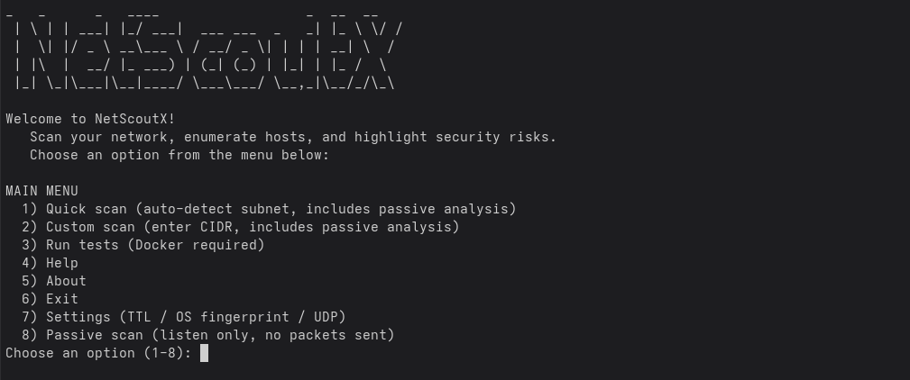

# NetScoutX

[](https://pkg.go.dev/github.com/hexe/net-scout)
[](https://opensource.org/licenses/MIT)
[](https://github.com/hexe/net-scout/actions/workflows/go.yml)


<p align="center">
  
</p>

```
  _   _      _   ____                  _   __  __
 | \ | | ___| |_/ ___|  ___ ___  _   _| |_ \ \/ /
 |  \| |/ _ \ __\___ \ / __/ _ \| | | | __| \  / 
 | |\  |  __/ |_ ___) | (_| (_) | |_| | |_ /  \ 
 |_| \_|\___|\__|____/ \___\___/ \__,_|\__/_/\_\
```

## Project Overview

NetScoutX to narzędzie do rekonesansu sieci zrobione z myślą o praktycznych zastosowaniach, a nie o ładnych slajdach. Łączy klasyczne, aktywne skanowanie z pasywną analizą ruchu, dzięki czemu widzisz nie tylko to, co odpowiada na portach, ale też to, co faktycznie gada w Twojej sieci.

Projekt rozwijany jest przez Hexe (Synth1ca Cybersec). Założenia są proste: ma być jasno, konkretnie i użytecznie dla osób, które naprawdę utrzymują i bronią sieci – od homelabu po bardziej cywilizowane środowiska.

## Quickstart

Jeśli chcesz po prostu odpalić toola i zobaczyć, co się dzieje w sieci:

```bash
# Tryb interaktywny (najprostszy start)
sudo netscoutx

# Szybki aktywny skan np. domowej sieci
sudo net-scout -subnet 192.168.0.0/24 -output scan.json

# Aktywny skan + krótki podsłuch pasywny
sudo net-scout -subnet 192.168.0.0/24 -passive-duration 20s -output baseline.json
```

## Features

NetScoutX nie próbuje być wszystkim naraz. Skupia się na sieci i na tym, żebyś szybko zobaczył, które hosty są ciekawe lub podejrzane.

### Active Engine

* **Host discovery:** Lekki discovery po TCP na zadanym zakresie, z sondowaniem popularnych portów (80, 22, 21, 443).
* **Port scanning:** Równoległy skan TCP dla sensownej listy usług (20, 21, 22, 23, 25, 53, 80, 110, 135, 139, 143, 443, 445, 993, 995, 1723, 3306, 3389, 5900, 8080).
* **UDP scanning:** Strzelanie w wybrane UDP (DNS 53, NTP 123, SNMP 161, SSDP 1900, mDNS 5353) z rozpoznaniem usług.
* **Service fingerprinting:** Banners / wersje usług dla SSH, HTTP (Server), FTP i kilku innych.
* **OS guessing:** Zgaduj-zgadula na podstawie TTL i bannerów – „best effort”, nie magia.
* **Vulnerability lookup:** Prosty wbudowany „vuln DB” oparty na bannerach – wystarcza, żeby złapać oczywiste kwiatki.

### Passive Engine (na `gopacket` / `libpcap`)

* **Multi-interface capture:** Podsłuch na wielu interfejsach równolegle.
* **ARP passive discovery:** Śledzenie ARP, mapowanie IP ↔ MAC, lookup vendorów po OUI.
* **DHCP parsing:** Wyciąganie przydziałów IP, hostname’ów i vendor class. Wykrywanie DHCP serwerów i ew. podejrzanych / „rogue”.
* **mDNS service discovery:** Odczytywanie usług typu `_http._tcp.local` itp. – idealne, żeby złapać IoT-y i ich „talenty”. Flagowanie wrażliwych ogłoszeń przez mDNS.
* **DNS query parsing:** Analiza zapytań DNS, wykrywanie domen o wysokiej entropii (DGA) i nietypowych TLD.
* **TLS JA3 fingerprinting:** Wyciąganie JA3 z ClientHello, żeby rozróżniać typy klientów (przeglądarki, narzędzia, malware). Uwaga: funkcja wciąż w rozbudowie.
* **Passive scoring contribution:** Wszystko, co zobaczymy pasywnie, idzie do wyniku ryzyka hosta.

### ARP Analysis

* **Strukturyzowane anomalie:** Wykrywanie `ip_conflict` (jeden IP, wiele MAC) oraz `greedy_mac` (jeden MAC, wiele IP).
* **Klasyfikacja powagi:** Otagowane poziomy ryzyka (High / Medium / Low), z próbą rozpoznania „to tylko gateway, nie panikuj”.
* **Wpływ na risk score:** ARP nie ląduje w logu „na potem” – bezpośrednio podbija punktację hosta.

### Command-Line Interfaces (CLIs)

Masz do wyboru dwa podejścia:

1. **`net-scout` (CLI „na flagach”):** Bez udziwnień, dobre do skryptów i automatyzacji.
2. **`net-scout-cli` (`netscoutx` – interaktywny TUI):**
   * **Quick scan:** Auto-detekcja podsieci i od razu aktywne + pasywne skanowanie.
   * **Custom scan:** Ręcznie podany CIDR, dalej ten sam pipeline.
   * **Passive-only:** Tylko podsłuch, zero generowanego ruchu.
   * **Merged overview:** Jedna tabela z widokiem IP / MAC / vendor / risk / JA3 / porty.
   * **Passive summary:** Zbiorcze statystyki z pasywki.
   * **Settings:** Włączanie / wyłączanie TTL OS fingerprint, UDP itp.
   * **JSON export:** Pełny raport do dalszego przetwarzania.
   * **Result diffing:** Porównanie aktualnego skanu z bazowym JSON-em (drift, nowe usługi, nowe ryzyka).

<p align="center">
  
</p>

## Why NetScoutX vs Nmap?

NetScoutX nie próbuje zabić Nmapa – ma z nim współpracować.

- **Aktywne + pasywne:** Jednocześnie skanuje i podsłuchuje, więc łapie hosty, które niekoniecznie odpowiadają na proste SYN-y.
- **Wbudowany risk scoring:** Nie musisz się wpatrywać w listę portów. Od razu widzisz, które hosty są „czerwone”.
- **Anomaly detection:** ARP, DHCP, DNS, mDNS – heurystyki, które wyciągają na wierzch konflikty IP, podejrzane DHCP, dziwne domeny czy „gadające” IoT-y.
- **Baseline diffing:** Raporty JSON można ze sobą porównywać – idealne do wyłapywania zmian w czasie.

Najlepszy efekt jest wtedy, gdy odpalasz NetScoutX obok Nmapa i innych ulubionych narzędzi. Każde robi swoje, a Ty dostajesz pełniejszy obraz tego, co żyje w sieci.

## Architecture Overview

Pod maską NetScoutX wygląda mniej więcej tak:

```
+-------------------+       +-------------------+
|   Active Engine   |       |   Passive Engine  |
|-------------------|       |-------------------|
| - Host Discovery  |       | - Packet Capture  |
| - Port Scanning   |       |   (libpcap/gopacket)|
| - UDP Scanning    |       | - ARP Parser      |
| - Service Finger. |       | - DHCP Parser     |
| - OS Guessing     |       | - mDNS Parser     |
+-------------------+       | - DNS Parser      |
          |                 | - TLS JA3 Parser  |
          |                 +-------------------+
          |                           |
          |                           |
          v                           v
+-------------------------------------------------+
|             Merge & Analysis Pipeline           |
|-------------------------------------------------|
| 1. Active TCP Discovery                         |
| 2. ARP Enrichment (active ARP requests)         |
| 3. Passive Collection (ARP/DHCP/mDNS/DNS/JA3)   |
| 4. ARP Anomaly Analysis (structured)            |
| 5. Port Scan (TCP/UDP)                          |
| 6. Service Fingerprinting                       |
| 7. OS Guessing                                  |
| 8. Merge Passive & Active Results               |
| 9. Risk Evaluation (incorporating passive data) |
+-------------------------------------------------+
          |
          v
+-------------------+
|    CLI & Reports  |
|-------------------|
| - Interactive TUI |
| - Flag-based CLI  |
| - JSON Export     |
| - Console Output  |
| - Baseline Diff   |
+-------------------+
```

### Key Components

* `internal/scanner` – cała logika aktywnego skanu: discovery, porty, OS guess, risk score.
* `internal/passive` – silnik pasywny: capture, parsowanie ARP / DHCP / mDNS / DNS / TLS.
* `internal/merge` – miejsce, gdzie aktywne i pasywne dane sklejają się w jedną reprezentację hosta.
* `internal/report` – generowanie czytelnego outputu w konsoli i JSON.
* `cmd/net-scout` i `cmd/net-scout-cli` – entrypointy do obu CLI.

## Installation

Do zbudowania NetScoutX potrzebujesz Go 1.22+ i `libpcap`.

### Prerequisites

* **Go 1.22+** – standardowa instalacja Go.
* **`libpcap` dev:**
  * Ubuntu/Debian: `sudo apt-get update && sudo apt-get install libpcap-dev`
  * CentOS/RHEL: `sudo yum install libpcap-devel`
  * macOS: `brew install libpcap`

### „Oficjalna” instalacja (system-wide)

1. Budowanie interaktywnego CLI:

   ```bash
   go build -o netscoutx ./cmd/net-scout-cli
   ```

2. Przeniesienie binarki gdzieś w `PATH`:

   ```bash
   sudo mv netscoutx /usr/local/bin/
   ```

   W praktyce `netscoutx` najczęściej odpalisz z `sudo`. Do pasywki / TTL fingerprintingu potrzebny jest dostęp do raw socketów (np. `setcap cap_net_raw,cap_net_admin+ep /path/to/netscoutx`).

### Budowanie CLI na flagach

```bash
go build -o net-scout ./cmd/net-scout
```

## Usage Examples

### Interaktywny CLI (`netscoutx`)

Najprostsza ścieżka:

```bash
sudo netscoutx
```

Zobaczysz główne menu:

```text
MAIN MENU
  1) Quick scan (auto-detect subnet, includes passive analysis)
  2) Custom scan (enter CIDR, includes passive analysis)
  3) Run tests (Docker required)
  4) Help
  5) About
  6) Exit
  7) Settings (TTL / OS fingerprint / UDP)
  8) Passive scan (listen only, no packets sent)
```

#### Przykład: Quick Scan (aktywny + pasywny)

Opcja `1` odpala pełen pipeline na wykrytej podsieci.

```text
$ sudo netscoutx
  _   _      _   ____                  _   __  __
 | \ | | ___| |_/ ___|  ___ ___  _   _| |_ \ \/ /
 |  \| |/ _ \ __\___ \ / __/ _ \| | | | __| \  / 
 | |\  |  __/ |_ ___) | (_| (_) | |_| | |_ /  \ 
 |_| \_|\___|\__|____/ \___\___/ \__,_|\__/_/\_\
Welcome to NetScoutX!
   Scan your network, enumerate hosts, and highlight security risks.
   Choose an option from the menu below:

MAIN MENU
  1) Quick scan (auto-detect subnet, includes passive analysis)
  2) Custom scan (enter CIDR, includes passive analysis)
  3) Run tests (Docker required)
  4) Help
  5) About
  6) Exit
  7) Settings (TTL / OS fingerprint / UDP)
  8) Passive scan (listen only, no packets sent)
Choose an option (1-8): 1

QUICK SCAN
Attempting to detect your local subnet...
Using detected subnet: 192.168.1.0/24
Results will be saved to quick_scan_20251117_123456.json
Compare with previous JSON report? (y/N): n

Starting scan for subnet: 192.168.1.0/24
Passive analysis will run in parallel for 10 seconds...
Initializing active host discovery...
Enriching hosts with ARP data...
Discovered 3 hosts.
Analyzing network anomalies...
Scanning ports and services...
... fingerprinting services and OS...
Active scan completed.
Merging passive and active results...
Performing final risk evaluation...

============================================================
SCAN RESULTS
============================================================

GENERAL WARNINGS:
   - ARP anomaly: MAC 00:11:22:33:44:55 is associated with multiple IP addresses: [192.168.1.1, 192.168.1.100]
   - ARP anomaly: MAC 00:11:22:33:44:55 acts as a gateway/proxy for 2 IPs (e.g., 192.168.1.1)

ACTIVE SCAN SUMMARY:
   - Actively probed hosts: 2
   - Scan duration: 12.543s

PASSIVE DISCOVERY SUMMARY:
   - Passively discovered hosts: 3
   - DHCP servers observed: 1

HOST OVERVIEW:
IP             MAC                VENDOR          HOSTNAME        RISK           JA3s   OPEN PORTS
192.168.1.1    00:11:22:33:44:55  Cisco           router.local    medium (45)    0      80/tcp, 443/tcp, 53/udp
192.168.1.100  00:22:33:44:55:66  Intel           my-pc           medium (30)    1      22/tcp, 8080/tcp
192.168.1.101  00:aa:bb:cc:dd:ee  Raspberry Pi F. raspberrypi     low (10)       0      -

--- Scan Results for subnet 192.168.1.0/24 ---
Scan finished in 12.543s. Found 3 host(s).

--- Detailed Host Report ---
--------------------------------------------------
HOST: 192.168.1.1 (00:11:22:33:44:55)
  OS (guess): Network device (Cisco)
  Risk: Medium (45/100)
  Open ports:
    PORT  PROTO  SERVICE  DETAILS
    80    tcp    HTTP     Server: Apache/2.4.29
    443   tcp    HTTPS    Server: nginx/1.18.0
    53    udp    DNS      
--------------------------------------------------
HOST: 192.168.1.100 (00:22:33:44:55:66)
  OS (guess): Linux (OpenSSH)
  Risk: Medium (30/100)
  Open ports:
    PORT  PROTO  SERVICE  DETAILS
    22    tcp    SSH      SSH-2.0-OpenSSH_8.2p1
    8080  tcp    HTTP     Server: Caddy/2.4.5
--------------------------------------------------
HOST: 192.168.1.101 (00:aa:bb:cc:dd:ee)
  OS (guess): Unknown
  Risk: Low (10/100)
  Open ports: none detected
--------------------------------------------------

=== Security summary ===
  Hosts scanned: 3
  High risk:   0
  Medium risk: 2
  Low risk:    1
```

#### Przykład: tylko pasywka

Opcja `8` odpala sam silnik pasywny. Żadnych pakietów wychodzących, tylko podsłuch.

```text
$ sudo netscoutx
... 
MAIN MENU
... 
  8) Passive scan (listen only, no packets sent)
Choose an option (1-8): 8

PASSIVE SCAN
Starting passive network analysis. This will run until you stop it (Ctrl+C).
Listening for ARP, DHCP, mDNS, DNS, and TLS fingerprints...
Capture started. Press Ctrl+C to stop and see results.
^C
Passive: stopping capture...
Passive: capture stopped.

============================================================
PASSIVE SCAN RESULTS
============================================================

PASSIVE DISCOVERY SUMMARY:
   - Passively discovered hosts: 2
   - DHCP servers observed: 1

HOST OVERVIEW:
IP             MAC                VENDOR          HOSTNAME        RISK           JA3s   OPEN PORTS
192.168.1.100  00:22:33:44:55:66  Intel           my-pc           low (5)        1      -
192.168.1.102  00:ff:ee:dd:cc:bb  Samsung         smart-tv        low (8)        0      -
```

### Flag-based CLI (`net-scout`)

```bash
# Prosty skan aktywny
sudo ./net-scout -subnet 192.168.1.0/24 -output scan_report.json

# Aktywny skan + UDP + pasywka 30s
sudo ./net-scout -subnet 192.168.1.0/24 -enable-udp -passive-duration 30s -output scan_report_full.json
```

## Risk Scoring – o co chodzi z punktami

NetScoutX liczy wynik ryzyka w skali 0–100. To nie jest CVSS, tylko szybka heurystyka, która ma Ci powiedzieć „na co spojrzeć najpierw”.

Pod uwagę brane są m.in.:

* **Open ports:** każdy otwarty port coś dokłada.
* **Vulnerabilities:** podatności wynikające z bannerów (CRITICAL / HIGH / MEDIUM) mocno podnoszą punktację.
* **Konkretnie niebezpieczne usługi:** Telnet, SMB, RDP i spółka.
* **HTTP bez HTTPS:** HTTP na 80 bez sensownego HTTPS na 443 = dodatkowe punkty.
* **ARP anomalies:** konflikt IP / dziwnie zachowujący się MAC = spory bonus do ryzyka.
* **Sygnały z pasywki:**
  * hosty widziane tylko pasywnie,
  * obecność JA3,
  * DNS-y do dziwnych / „entropijnych” domen,
  * wycieki przez mDNS,
  * potencjalnie rogue DHCP.

## Anomaly Detection

NetScoutX nie tylko wypisuje hosty, ale też stara się wytłumaczyć, dlaczego coś jest nie tak.

* **ARP:**
  * `ip_conflict` – ten sam IP widziany z różnych MAC-ów (od razu pachnie ARP spoofingiem albo grubą mis-konfiguracją).
  * `greedy_mac` – jeden MAC zbiera wiele IP. Czasem to normalny router, czasem coś bardziej kreatywnego. Tool próbuje odsiać typowe gatewaye.
* **DHCP:**
  * wykrywanie rogue DHCP – nieznane serwery, dziwni vendorzy, wiele serwerów w jednym segmencie.
* **DNS:**
  * domeny o wysokiej entropii (podejrzenie DGA),
  * egzotyczne / podejrzane TLD.
* **mDNS:**
  * usługi, które niekoniecznie chciałbyś ogłaszać w całej sieci (np. udostępnianie plików, remote access).
* **JA3:**
  * planowane jest lepsze wykrywanie „dziwnych” fingerprintów, typowych dla custom tooli / malware.

## JSON Report – co w środku

NetScoutX potrafi wyrzucić pełny raport w JSON. Struktura `ScanResult` wygląda mniej więcej tak:

```json
{
  "timestamp": "2025-11-17T12:34:56.789Z",
  "subnet": "192.168.1.0/24",
  "hosts": [
    {
      "ip": "192.168.1.1",
      "mac": "00:11:22:33:44:55",
      "hostname": "router.local",
      "os_guess": "Network device (Cisco)",
      "os_confidence": "medium",
      "open_ports": [
        {
          "number": 53,
          "protocol": "udp",
          "state": "open",
          "service": "DNS"
        },
        {
          "number": 80,
          "protocol": "tcp",
          "state": "open",
          "service": "HTTP",
          "version": "Apache/2.4.29",
          "banner": "Server: Apache/2.4.29",
          "vulnerabilities": [
            {
              "cve_id": "CVE-2018-1312",
              "description": "Path traversal in Apache HTTPD 2.4.29 allowing exposure of arbitrary files.",
              "severity": "HIGH"
            }
          ]
        },
        {
          "number": 443,
          "protocol": "tcp",
          "state": "open",
          "service": "HTTPS",
          "version": "nginx/1.18.0",
          "banner": "Server: nginx/1.18.0"
        }
      ],
      "risk_score": 45,
      "risk_level": "medium",
      "arp_flags": [
        "greedy_mac"
      ],
      "ja3_fingerprints": [],
      "dns_queries": [],
      "passively_discovered": false
    },
    {
      "ip": "192.168.1.100",
      "mac": "00:22:33:44:55:66",
      "hostname": "my-pc",
      "os_guess": "Linux (OpenSSH)",
      "os_confidence": "medium",
      "open_ports": [
        {
          "number": 22,
          "protocol": "tcp",
          "state": "open",
          "service": "SSH",
          "version": "SSH-2.0-OpenSSH_8.2p1",
          "banner": "SSH-2.0-OpenSSH_8.2p1"
        },
        {
          "number": 8080,
          "protocol": "tcp",
          "state": "open",
          "service": "HTTP",
          "version": "Caddy/2.4.5",
          "banner": "Server: Caddy/2.4.5"
        }
      ],
      "risk_score": 30,
      "risk_level": "medium",
      "arp_flags": [],
      "ja3_fingerprints": [
        "e7d705a3286e19ea42f587b344ee6865"
      ],
      "dns_queries": [
        "www.google.com",
        "update.microsoft.com"
      ],
      "passively_discovered": false
    },
    {
      "ip": "192.168.1.101",
      "mac": "00:aa:bb:cc:dd:ee",
      "hostname": "raspberrypi",
      "os_guess": "Unknown",
      "os_confidence": "low",
      "open_ports": [],
      "risk_score": 10,
      "risk_level": "low",
      "arp_flags": [],
      "ja3_fingerprints": [],
      "dns_queries": [],
      "passively_discovered": true
    }
  ],
  "scan_duration": "12.543s",
  "security_warnings": [
    "ARP anomaly: MAC 00:11:22:33:44:55 is associated with multiple IP addresses: [192.168.1.1, 192.168.1.100]",
    "ARP anomaly: MAC 00:11:22:33:44:55 acts as a gateway/proxy for 2 IPs (e.g., 192.168.1.1)"
  ]
}
```

## Contributing

Jeśli NetScoutX Ci się przydaje i chcesz coś dorzucić, zajrzyj do `CONTRIBUTING.md`. Pull requesty są mile widziane – od fixów literówek po nowe heurystyki i parsery.

## License

NetScoutX jest wydany na licencji MIT. Szczegóły znajdziesz w pliku `LICENSE`.

## Maintainer Info

**Hexe**

* Founder of SYNTH1CA LABS | PROSTA SPÓŁKA AKCYJNA
* CFO - Head of developers
* Cybersecurity Engineer
* ex Tattoo Artist 

## Credits

* `gopacket` – solidny fundament do capture i dekodowania.
* `golang.org/x/net/icmp` – pod TTL / ICMP.
* Społeczność – za feedback, bug reporty i pomysły.
* `https://www.linkedin.com/in/lucas-piatek-891201376/` i `https://varasystems.eu/` oraz `https://entropy.varasystems.eu/` – jeśli chcesz obczaić mnie poza GitHubem.

Jeśli interesuje Cię, co dalej z projektem, zajrzyj do `codozrobienia.md` – tam są bardziej „ludzkie” notatki z pomysłami na rozwój.
---
